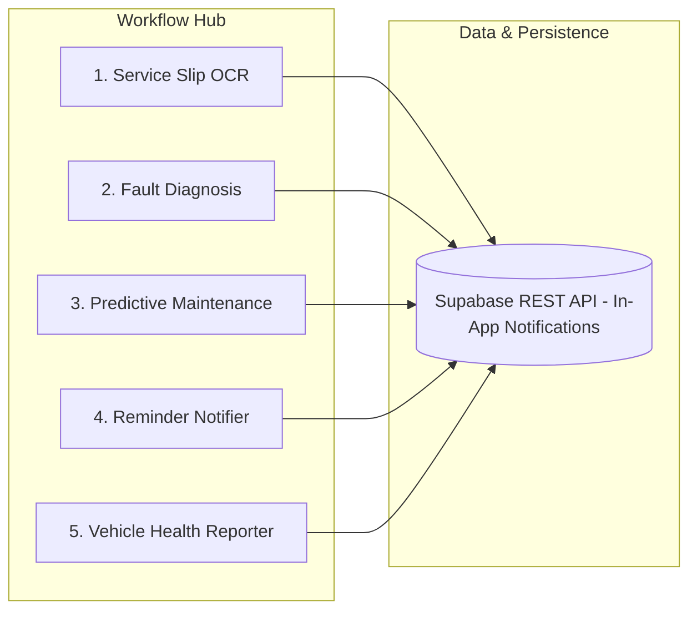

# Week 6 — Final n8n AI & Automation Architecture Report

## 📌 Executive Summary
During Week 6, the **AI & Automation Engineering team** finalized and deployed all 5 core n8n automation workflows, establishing an integrated, multi-channel notification engine, automated fault diagnosis alerting, and weekly AI vehicle health reporting.

---

## 🗺️ Architecture Overview (5 Workflows)



---

## 🔍 Detailed Workflow Breakdown

### Workflow 1: Service Slip OCR Pipeline
* **File:** `n8n/service_slip_workflow.json`
* **Trigger:** POST Webhook `/service-slip`
* **Purpose:** OCR processing of physical service bills via Tesseract & FastAPI LLM, saving extracted line items directly to Supabase.

### Workflow 2: Fault Diagnosis Intelligence Pipeline
* **File:** `n8n/fault_diagnosis_workflow.json`
* **Trigger:** POST Webhook `/diagnose-fault`
* **Purpose:** RAG retrieval + Claude 3 Haiku diagnosis. Features automated severity branching — if **Critical**, triggers instant auto opt-in in-app safety notification to vehicle owners.

### Workflow 3: Predictive Maintenance Trigger
* **File:** `n8n/predictive_maintenance_trigger_workflow.json`
* **Trigger:** Schedule / Event
* **Purpose:** Rules Engine integration calculating upcoming service intervals based on odometer mileage & vehicle age.

### Workflow 4: Multi-Entity Reminder Notifier
* **File:** `n8n/reminder_notifier_workflow.json`
* **Trigger:** Daily Cron (00:00)
* **Purpose:** Unified query engine pulling maintenance due dates, insurance policies (<30 days expiry), PUC certificates (<15 days expiry), and FASTag balances (<₹200). Features static cache deduplication and queues in-app notifications.

### Workflow 5: Weekly Vehicle Health Reporter
* **File:** `n8n/vehicle_health_reporter_workflow.json`
* **Trigger:** Weekly Cron (Mon 09:00 AM)
* **Purpose:** Aggregates full vehicle context, computes a 0-100 Health Score using Claude 3 Haiku, and dispatches a weekly summary in-app notification to users.

---

## 🧪 Verification & Regression Test Suite
All 5 workflows are fully covered by automated regression tests in [`tests/test_n8n_regression.py`](./tests/test_n8n_regression.py) and [`tests/test_n8n_workflows.py`](./tests/test_n8n_workflows.py).

* **Test Suite Command:**
  ```powershell
  python -m pytest -p no:asyncio tests/
  ```
* **Result:** **35 / 35 tests passed 100%**.
