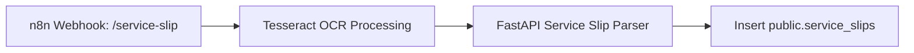
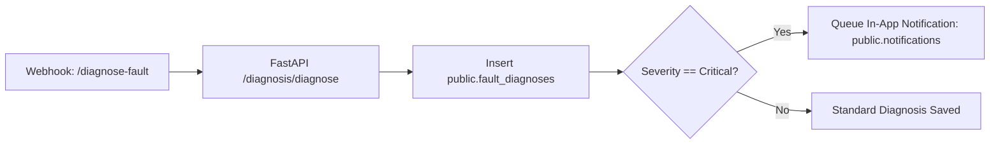
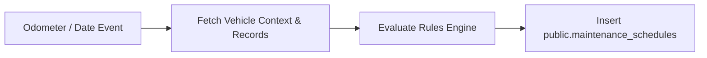
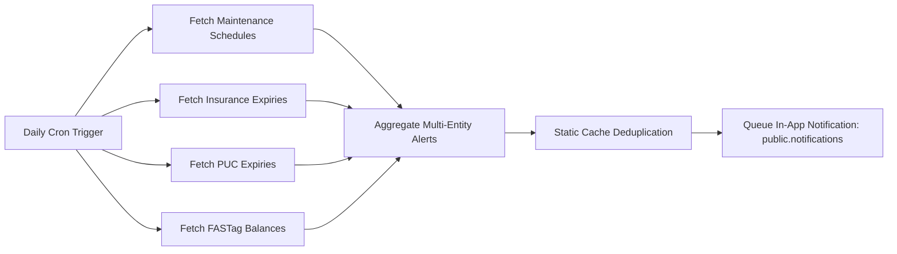
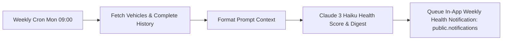

# VehiCare AI & Automation — Final n8n Workflows Architecture

This document details the complete end-to-end architecture, node connectivity, trigger specs, and integration diagrams for all 5 core n8n automation workflows in the **VehiCare AI System**.

---

## 🏗️ System Overview Diagram

```mermaid
flowchart TD
    subgraph Inputs & Triggers
        A1[Service Slip Upload]
        A2[User Symptom Webhook]
        A3[Odometer & History Rules Engine]
        A4[Daily Reminder Cron]
        A5[Weekly Reporter Cron]
    end

    subgraph n8n Workflow Automation Hub
        W1[1. Service Slip OCR Pipeline]
        W2[2. Fault Diagnosis Pipeline]
        W3[3. Predictive Maintenance Pipeline]
        W4[4. Reminder Notifier Workflow]
        W5[5. Vehicle Health Reporter]
    end

    subgraph Processing & AI Services
        P1[Tesseract OCR Engine]
        P2[FastAPI LLM Parser]
        P3[Claude 3 Haiku / RAG]
        P4[Rules Engine Evaluator]
        P5[Multi-Entity Aggregator]
    end

    subgraph Supabase Database Tables (In-App Delivery)
        DB1[(service_slips)]
        DB2[(fault_diagnoses)]
        DB3[(maintenance_schedules)]
        DB4[(notifications - in_app)]
    end

    A1 --> W1 --> P1 --> P2 --> DB1
    A2 --> W2 --> P3 --> DB2
    W2 -- Critical Fault --> DB4
    A3 --> W3 --> P4 --> DB3
    A4 --> W4 --> P5 --> DB4
    A5 --> W5 --> P3 --> DB4
```

---

## 📋 Summary of Workflows

| # | Workflow Name | JSON File Path | Trigger Type | Primary Outputs | Provider Integrations |
|---|---|---|---|---|---|
| **1** | Service Slip OCR Pipeline | [`n8n/service_slip_workflow.json`](./service_slip_workflow.json) | Webhook (`/service-slip`) | Ingests service slips & line items | Tesseract OCR + FastAPI LLM + Supabase |
| **2** | Fault Diagnosis Pipeline | [`n8n/fault_diagnosis_workflow.json`](./fault_diagnosis_workflow.json) | Webhook (`/diagnose-fault`) | Saves diagnosis & triggers Critical in-app alerts | Claude 3 Haiku + Supabase REST |
| **3** | Predictive Maintenance Trigger | [`n8n/predictive_maintenance_trigger_workflow.json`](./predictive_maintenance_trigger_workflow.json) | Schedule / Event | Generates upcoming maintenance schedules | Rules Engine + Supabase REST |
| **4** | Reminder Notifier Workflow | [`n8n/reminder_notifier_workflow.json`](./reminder_notifier_workflow.json) | Daily Cron (00:00) | Multi-entity due-soon in-app reminders | Maintenance + Insurance + PUC + FASTag + Supabase |
| **5** | Vehicle Health Reporter | [`n8n/vehicle_health_reporter_workflow.json`](./vehicle_health_reporter_workflow.json) | Weekly Cron (Mon 09:00) | 0-100 Health Score & Weekly in-app digest | Claude 3 Haiku + Supabase REST |

---

## 🔄 Detailed Workflow Architecture

### 1. Service Slip OCR Pipeline Workflow (`service_slip_workflow.json`)


### 2. Fault Diagnosis Intelligence Pipeline (`fault_diagnosis_workflow.json`)


### 3. Predictive Maintenance Trigger Workflow (`predictive_maintenance_trigger_workflow.json`)


### 4. Reminder Notifier Workflow (`reminder_notifier_workflow.json`)


### 5. Vehicle Health Reporter Workflow (`vehicle_health_reporter_workflow.json`)


---

## 🛠️ Required Environment Variables

For n8n execution environment (`.env`):
* `DIAGNOSIS_N8N_WEBHOOK_URL`: n8n diagnosis trigger URL
* `OPENROUTER_API_KEY`: OpenRouter API key for Claude 3 Haiku
* `SUPABASE_URL` / `SUPABASE_SERVICE_ROLE_KEY`: Supabase REST & Auth access (for In-App notifications)
